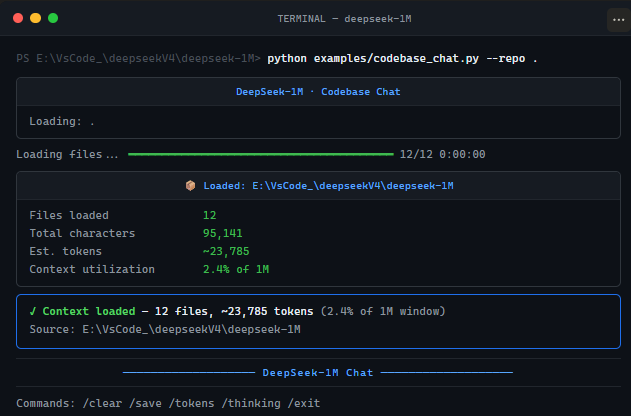
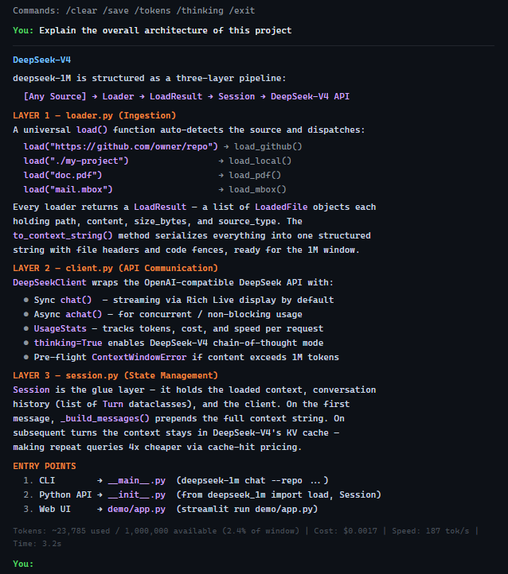

# 🚀 deepseek-1M

**Chat with your entire codebase, documents, or email archive — using DeepSeek-V4's 1,000,000-token context window.**

No chunking. No embeddings. No RAG. Just DeepSeek-V4 holding everything in memory.

[](https://www.python.org/downloads/)
[](LICENSE)
[](https://platform.deepseek.com)
[](https://pypi.org/project/deepseek-1m/)
[](https://pypi.org/project/deepseek-1m/) 
[](https://github.com/bevinkatti/deepseek-1M)

---

## What is this?

DeepSeek-V4 just launched with a **1,000,000 token context window** — that's roughly:

| What | How much |
|---|---|
| Lines of code | ~30,000 lines |
| Pages of text | ~2,500 pages |
| Emails | ~5,000 emails |
| Novels | ~6 full-length books |

`deepseek-1M` is a toolkit that makes this actually useful. Load any source, chat freely.

---

## Demo




### 🗂 Chat with a GitHub Repo

```bash
export DEEPSEEK_API_KEY=your_key
deepseek-1m chat --repo https://github.com/fastapi/fastapi
```

```
📦 Loaded: github.com/tiangolo/fastapi@master
┌──────────────────────┬────────────────────┐
│ Stat                 │ Value              │
├──────────────────────┼────────────────────┤
│ Files loaded         │ 347                │
│ Total characters     │ 1,842,391          │
│ Est. tokens          │ ~460,598           │
│ Context utilization  │ 46.1% of 1M        │
└──────────────────────┴────────────────────┘

You: How does FastAPI handle dependency injection?

DeepSeek-V4: FastAPI's dependency injection is handled through the `Depends()`
function in `fastapi/dependencies/utils.py`. When you declare a path operation:

    @app.get("/items/")
    async def read_items(db: Session = Depends(get_db)):

FastAPI calls `solve_dependencies()` which recursively resolves the dependency
graph. The key files are:
- `fastapi/dependencies/utils.py` — core resolution logic (line 462: `solve_dependencies`)
- `fastapi/params.py` — the `Depends` class definition
- `fastapi/_compat.py` — Pydantic v1/v2 compatibility layer for parameter types

Sub-dependencies are cached per request by default via `use_cache=True`...
```

### 📚 Analyze a Full PDF

```bash
deepseek-1m chat --pdf research_paper.pdf --model deepseek-v4-pro --thinking
```

### 📧 Chat With Your Email Archive

```bash
# Export from Gmail: takeout.google.com → Mail → .mbox
deepseek-1m chat --mbox ~/Downloads/mail.mbox
```

```
You: Who have I emailed most in the past year?

DeepSeek-V4: Based on your archive (2,847 emails loaded), your top contacts are:

1. sarah@company.com — 312 emails (mostly project coordination, Q3 launch)
2. dev-team@company.com — 287 emails (code reviews, standups)
3. john.smith@client.com — 156 emails (contract negotiations, ongoing since March)
...

You: Did anyone ever follow up on the Q3 budget discussion?

DeepSeek-V4: Yes — there were 3 emails about Q3 budget:
- Aug 12: You sent initial proposal to finance@company.com
- Aug 15: Mike replied asking for revised numbers
- Aug 17: You sent revised version

But I don't see any response after Aug 17. This thread appears unresolved.
```

---

## Install

```bash
pip install deepseek-1m

# With PDF support
pip install "deepseek-1m[pdf]"

# With web demo
pip install "deepseek-1m[all]"
```

---

## Quickstart

### Python API

```python
from deepseek_1m import load, Session

# Load a GitHub repo
ctx = load("https://github.com/fastapi/fastapi")

# Start chatting — the whole repo is in memory
session = Session(context=ctx)
session.chat()
```

```python
# Load a local project
ctx = load("./my-project")
session = Session(context=ctx)
answer = session.ask("What does this codebase do?")
```

```python
# Load a PDF
from deepseek_1m import load_pdf, Session

ctx = load_pdf("contract.pdf")
session = Session(context=ctx)
session.chat()
```

```python
# One-liner for quick questions (no context needed)
from deepseek_1m import ask
print(ask("Explain quantum entanglement in one sentence."))
```

### Async

```python
import asyncio
from deepseek_1m import DeepSeekClient

async def main():
    client = DeepSeekClient(model="deepseek-v4-pro")
    response = await client.achat(
        messages=[{"role": "user", "content": "Hello!"}]
    )
    print(response.content)

asyncio.run(main())
```

### Thinking Mode (Chain-of-Thought)

```python
client = DeepSeekClient(
    model="deepseek-v4-pro",
    thinking=True,
    reasoning_effort="high",
)
session = Session(client=client, show_thinking=True)
session.chat()
```

---

## Web Demo

```bash
pip install "deepseek-1m[all]"
streamlit run demo/app.py
```

Opens a beautiful web UI at `http://localhost:8501`:

- Upload a PDF, paste a GitHub URL, or point to a local folder
- Real-time context utilization bar (% of 1M window used)
- One-click suggested prompts
- Live cost and token tracking

---

## CLI Reference

```
deepseek-1m chat --repo <github_url>         # GitHub repo
deepseek-1m chat --folder <path>             # Local directory
deepseek-1m chat --pdf <file.pdf>            # PDF document
deepseek-1m chat --mbox <file.mbox>          # Email archive
deepseek-1m chat --url <https://...>         # Web page

deepseek-1m ask "your question"              # Quick one-off question
deepseek-1m demo                             # Launch web UI

Options:
  --model   deepseek-v4-flash (default, fast) | deepseek-v4-pro (best)
  --thinking                                 Enable chain-of-thought
  --github-token <token>                     For private repos
```

### Session Commands (during chat)

```
/tokens    — Show context utilization and cost so far
/thinking  — Toggle thinking mode display on/off
/save      — Save conversation to JSON
/clear     — Clear conversation (keeps context loaded)
/exit      — Quit
```

---

## Supported Sources

| Source | Command | Notes |
|---|---|---|
| GitHub repo (public) | `load("https://github.com/owner/repo")` | All text files, recursive |
| GitHub repo (private) | `load_github(url, token="ghp_...")` | Requires PAT |
| Local directory | `load("./my-project")` | Recursive, skips binaries |
| Single file | `load("./script.py")` | Any text file |
| PDF document | `load_pdf("doc.pdf")` | Text extraction |
| Email archive | `load_mbox("mail.mbox")` | Gmail, Outlook, Apple Mail |
| Web page | `load("https://example.com")` | Text extraction |

---

## Architecture

```
deepseek_1m/
├── client.py      # DeepSeek-V4 API client (sync + async, streaming, retry)
├── loader.py      # Universal source loader (GitHub, local, PDF, mbox, URL)
├── session.py     # Stateful chat session with 1M context management
└── __main__.py    # CLI entry point

examples/
├── codebase_chat.py    # Full GitHub/local repo chat
├── book_analysis.py    # PDF document analysis
└── email_archive.py    # Email archive chat

demo/
└── app.py              # Streamlit web interface

tests/
└── test_core.py        # 30+ tests covering all core functionality
```

---

## How the 1M Context Works

Traditional approaches to "chat with your data":
```
Your codebase → chunk into pieces → embed each chunk → vector database
→ similarity search at query time → hope the right chunks are retrieved
```

deepseek-1M:
```
Your codebase → one big string → DeepSeek-V4 (1M tokens) → answer
```

No retrieval. No missed context. No hallucinated answers because the right
chunk wasn't retrieved. The model sees **everything** simultaneously.

This only became practical with DeepSeek-V4's efficient attention architecture
([Compressed Sparse Attention](https://huggingface.co/deepseek-ai/DeepSeek-V4-Pro)),
which uses only 27% of single-token FLOPs and 10% of the KV cache of V3 at 1M tokens.

---

## Cost Estimates

| Source | Typical Size | Flash Cost | Pro Cost |
|---|---|---|---|
| Medium GitHub repo (300 files) | ~400K tokens | ~$0.028/query | ~$0.108/query |
| Research paper (100 pages) | ~80K tokens | ~$0.006/query | ~$0.022/query |
| 1,000 emails | ~150K tokens | ~$0.011/query | ~$0.041/query |
| Large monorepo (2000 files) | ~900K tokens | ~$0.063/query | ~$0.243/query |

*Input token pricing: Flash $0.07/1M, Pro $0.27/1M. Context caching reduces repeat costs significantly.*

---

## Requirements

- Python 3.10+
- DeepSeek API key ([get one free](https://platform.deepseek.com/api_keys))
- `openai`, `rich`, `tiktoken` (installed automatically)

Optional: `pypdf` for PDFs, `beautifulsoup4` for URLs, `streamlit` for web demo.

---

## Contributing

Contributions welcome! Ideas for new loaders:
- [ ] Notion workspace
- [ ] Google Docs / Drive
- [ ] Slack export (JSON format)
- [ ] Confluence pages
- [ ] YouTube transcripts
- [ ] Audio transcription → context

```bash
git clone https://github.com/bevinkatti/deepseek-1M
cd deepseek-1M
pip install -e ".[dev]"
pytest tests/ -v
```

---

## License

MIT — use it, fork it, ship it.

---

*Built in response to DeepSeek-V4's April 2026 launch with 1M token context.*  
*Contributions are welcome - and If this saved you time, give it a ⭐ or a Fork*